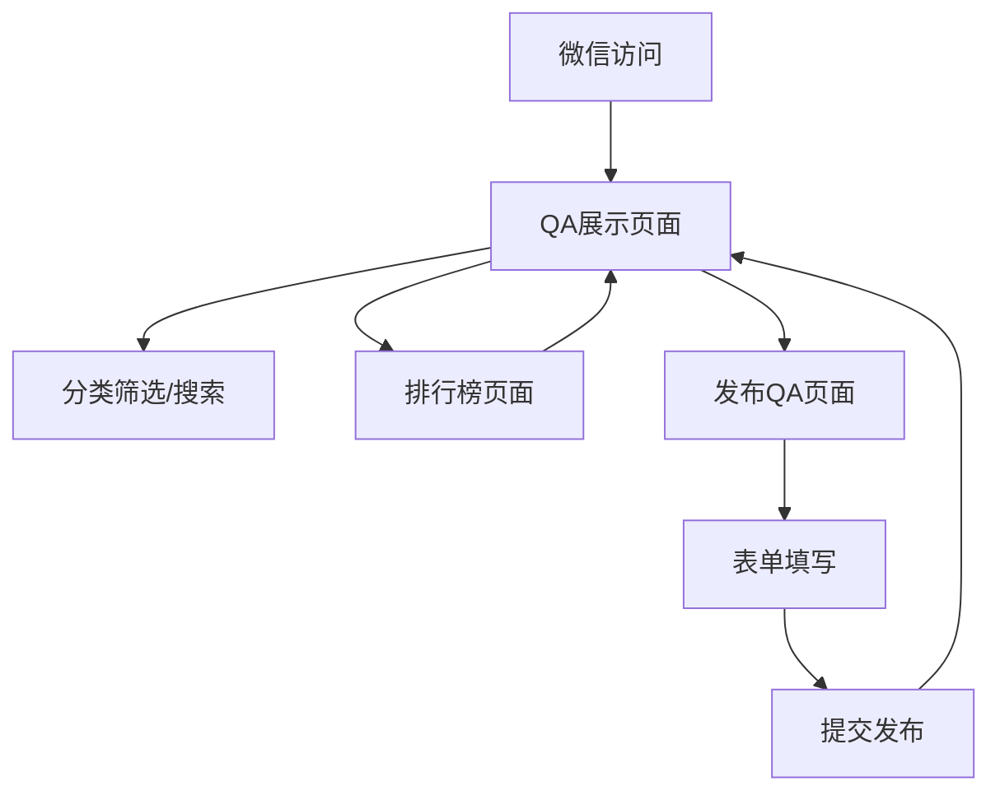

## 1. Product Overview
大学新生经验QA收集与展示平台，专为大学新生设计的问答经验分享平台。通过微信H5页面访问，帮助新生快速获取校园生活、学业发展等方面的实用经验，同时为老生提供分享经验的渠道。

平台主要解决新生入学初期的信息获取痛点，为他们提供可靠的校园经验来源，减少适应期的困惑和焦虑。

## 2. Core Features

### 2.1 访问机制与隐私保护 (Access & Privacy)
**核心机制：无登录系统**。平台采用"即用即走"的设计理念，所有访问者进入H5页面即可直接浏览所有内容，无需任何注册或登录步骤。

**发布时的信息收集与展示规则**：
在用户执行“发布QA”操作时，需要在表单中填写身份信息：
1. **姓名 & 学号**：必填。作为真实身份的校验和存档凭证，**仅后台可见**，系统严格保密，绝对不会在前端页面任何地方展示。
2. **昵称**：必填。作为用户在平台上的公开身份标识，将公开展示在“QA卡片”的发布者信息处，以及“排行榜”的列表中。

### 2.2 Feature Module
平台包含以下核心页面：
1. **QA展示页面**：信息流列表展示，包含分类标签和采纳状态
2. **排行榜页面**：展示活跃用户排名，按采纳答案数量排序
3. **发布QA页面**：用户发布问题和答案的表单页面

### 2.3 Page Details
| Page Name | Module Name | Feature description |
|-----------|-------------|---------------------|
| QA展示页面 | 信息流列表 | 垂直滑动展示QA卡片，包含分类标签、采纳徽章、问题答案内容、发布者信息 |
| QA展示页面 | 分类筛选 | 顶部显示分类标签，支持按分类筛选QA内容 |
| QA展示页面 | 搜索功能 | 支持关键词搜索问题和答案内容 |
| 排行榜页面 | 排名列表 | 显示用户排名、昵称（仅昵称公开展示）、被采纳数量，前三名特殊样式展示 |
| 排行榜页面 | 积分规则 | 显示积分获取规则和排行榜更新频率 |
| 发布QA页面 | 用户信息 | 必填项：姓名、学号、昵称。其中，学号输入框唤起数字键盘。注：姓名与学号仅供后台验证，前端绝对不展示。 |
| 发布QA页面 | 分类选择 | 使用级联选择器选择一级和二级分类 |
| 发布QA页面 | QA输入 | 问题描述输入框和答案内容输入框 |
| 发布QA页面 | 提交功能 | 提交并分享经验按钮，表单验证和提交反馈 |

## 3. Core Process
用户访问流程：
1. 用户通过微信访问平台，直接进入QA展示页面（无登录系统）
2. 浏览QA内容，可通过分类筛选和搜索功能查找特定内容
3. 查看排行榜了解活跃用户和被采纳情况（仅展示昵称）
4. 点击发布QA进入发布页面，填写身份信息（姓名/学号供后台验证，昵称用于展示）、选择分类、输入问题和答案
5. 提交后返回QA展示页面查看新发布的QA内容

## 4. User Interface Design

### 4.1 Design Style
- **主色调**：清新大学蓝 (#3B82F6) 或青绿色 (#10B981)
- **背景色**：极浅灰白色 (#F9FAFB, bg-gray-50)
- **卡片色**：纯白色 (#FFFFFF, bg-white)
- **字体颜色**：主标题深灰 (#1F2937)，正文中等灰 (#6B7280)
- **按钮样式**：圆角设计 (rounded-xl)，轻微阴影 (shadow-sm)
- **布局风格**：卡片式布局，大量留白，iOS风格简约现代
- **图标风格**：线性图标，简洁明了

### 4.2 Page Design Overview
| Page Name | Module Name | UI Elements |
|-----------|-------------|-------------|
| QA展示页面 | 顶部导航 | Vant Tabs组件，固定在顶部，三个标签：QA展示、排行榜、发布QA |
| QA展示页面 | QA卡片 | 白色卡片圆角设计，顶部左侧分类标签，右侧采纳徽章，中间问题加粗显示，答案正常字重，底部发布者信息 |
| 排行榜页面 | 排名列表 | 前三名金银铜特殊背景色，普通排名简洁列表，显示排名数字、用户昵称、采纳数量 |
| 发布QA页面 | 表单区域 | 白色背景，分组输入框，学号输入框数字键盘，级联选择器，文本域输入框，底部主按钮 |

### 4.3 Responsiveness
- **移动端优先**：专为手机端设计，完美适配各种手机屏幕尺寸
- **安全区适配**：考虑iPhone等设备的刘海和底部安全区域
- **触摸优化**：按钮和交互元素适合触摸操作，最小点击区域44px
- **响应式布局**：使用Flexbox和Grid实现自适应布局