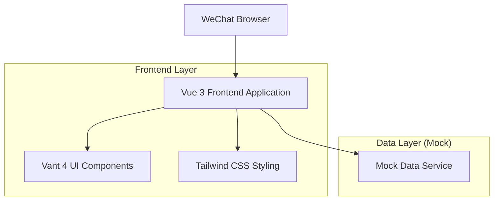

## 1. Architecture design



## 2. Technology Description
- Frontend: Vue 3@latest + Composition API + Vant 4@latest + Tailwind CSS@3
- Initialization Tool: vite-init
- Build Tool: Vite@latest
- Backend: None (使用Mock数据)
- UI Framework: Vant 4 (移动端组件库)
- CSS Framework: Tailwind CSS (原子化CSS)

## 3. Route definitions
| Route | Purpose |
|-------|---------|
| / | QA展示页面，默认首页 |
| /leaderboard | 排行榜页面，显示用户排名 |
| /publish | 发布QA页面，用户发布问题和答案 |

## 4. Component Structure

### 4.1 主要组件结构
```
src/
├── components/
│   ├── QACard.vue          # QA卡片组件
│   ├── LeaderboardItem.vue # 排行榜项组件
│   └── CategoryPicker.vue  # 分类选择器组件
├── views/
│   ├── QADisplay.vue       # QA展示页面
│   ├── Leaderboard.vue     # 排行榜页面
│   └── PublishQA.vue       # 发布QA页面
├── composables/
│   └── useMockData.js      # Mock数据钩子
└── App.vue                 # 根组件
```

### 4.2 Mock数据结构

QA数据类型定义：
```typescript
interface QAItem {
  id: string
  category: {
    primary: string    // 一级分类
    secondary: string  // 二级分类
  }
  question: string      // 问题内容
  answer: string        // 答案内容
  author: {
    nickname: string    // 发布者昵称
    studentId: string // 学号
  }
  isAdopted: boolean    // 是否被采纳
  createdAt: string     // 创建时间
  likes: number        // 点赞数
}

interface LeaderboardUser {
  rank: number
  nickname: string
  adoptedCount: number  // 被采纳数量
  totalAnswers: number // 总回答数
}
```

### 4.3 分类数据结构
```typescript
const categories = [
  {
    text: '学业发展',
    children: [
      { text: '选课建议' },
      { text: '学习方法' },
      { text: '考试技巧' },
      { text: '专业选择' }
    ]
  },
  {
    text: '校内生活',
    children: [
      { text: '宿舍生活' },
      { text: '食堂推荐' },
      { text: '社团活动' },
      { text: '校园设施' }
    ]
  },
  {
    text: '校外娱乐与生活',
    children: [
      { text: '周边美食' },
      { text: '交通便利' },
      { text: '购物推荐' },
      { text: '娱乐场所' }
    ]
  },
  {
    text: '信息获取与办事',
    children: [
      { text: '教务系统' },
      { text: '图书馆使用' },
      { text: '证件办理' },
      { text: '奖学金申请' }
    ]
  },
  {
    text: '其他',
    children: [
      { text: '通用建议' },
      { text: '心理调适' },
      { text: '时间规划' }
    ]
  }
]
```

## 5. 开发环境配置

### 5.1 项目初始化命令
```bash
# 使用pnpm创建项目
pnpm create vite university-qa-platform --template vue

# 进入项目目录
cd university-qa-platform

# 安装依赖
pnpm install

# 安装移动端UI组件库
pnpm add vant@latest

# 安装Tailwind CSS
pnpm add -D tailwindcss@latest postcss@latest autoprefixer@latest

# 初始化Tailwind配置
npx tailwindcss init -p

# 安装图标库（可选）
pnpm add @vant/icons
```

### 5.2 主要配置文件

vite.config.js:
```javascript
import { defineConfig } from 'vite'
import vue from '@vitejs/plugin-vue'
import { VantResolver } from 'unplugin-vue-components/resolvers'
import Components from 'unplugin-vue-components/vite'

export default defineConfig({
  plugins: [
    vue(),
    Components({
      resolvers: [VantResolver()],
    }),
  ],
  server: {
    host: '0.0.0.0',
    port: 3000
  }
})
```

tailwind.config.js:
```javascript
/** @type {import('tailwindcss').Config} */
export default {
  content: [
    "./index.html",
    "./src/**/*.{vue,js,ts,jsx,tsx}",
  ],
  theme: {
    extend: {
      colors: {
        primary: '#3B82F6', // 大学蓝
        secondary: '#10B981' // 青绿色
      }
    },
  },
  plugins: [],
}
```

### 5.3 移动端适配配置

index.html:
```html
<meta name="viewport" content="width=device-width, initial-scale=1.0, maximum-scale=1.0, minimum-scale=1.0, user-scalable=no, viewport-fit=cover">
<meta name="apple-mobile-web-app-capable" content="yes">
<meta name="apple-mobile-web-app-status-bar-style" content="black-translucent">
```

App.vue样式:
```css
/* 安全区适配 */
.safe-area-top {
  padding-top: constant(safe-area-inset-top);
  padding-top: env(safe-area-inset-top);
}

.safe-area-bottom {
  padding-bottom: constant(safe-area-inset-bottom);
  padding-bottom: env(safe-area-inset-bottom);
}
```